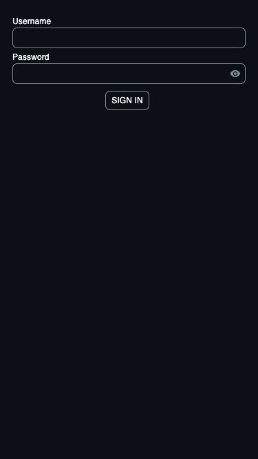
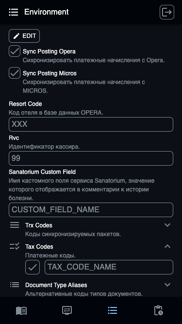

# SyncHms
Cервис интеграции систем [OPERA Hotel Property Management Solutions](https://hrs.ru/products/opera) и [Sanatorium Hospitality Management Solution](https://sanatorium-is.ru). Осуществляет передачу сообщений между интерфейсами систем посредством шины данных и предоставляет средства мониторинга интеграции.
* [Архитектура приложения](#архитектура-приложения)
* [Веб-интерфейс пользователя](#веб-интерфейс-пользователя)
* [Интегрированные сервисы](#интегрированные-сервисы)
	+ [Fias](#fias)
	+ [Opera](#opera)
	+ [Micros](#micros)
	+ [Sanatorium](#sanatorium)
	+ [Telegram](#telegram)
* [Окружение](#окружение)
* [Зависимости](#зависимости)
	+ [Шина данных](#шина-данных)
	+ [База данных](#база-данных)
	+ [Кеширование данных](#кеширование-данных)
	+ [Сервис идентификации пользователей](#сервис-идентификации-пользователей)
* [Запуск](#запуск)
	+ [Консоль](#консоль)
	+ [Docker](#docker)
	+ [Docker Compose](#docker-compose)
* [Обрабатываемые события](#обрабатываемые-события)
	+ [Синхронизация данных бронирования](#синхронизация-данных-бронирования)
	+ [Синхронизация платежного начисления](#синхронизация-платежного-начисления)
## Архитектура приложения

* *Полупрозрачным тоном обозначен функционал, который будет доступен в следующих версиях.*
## Веб-интерфейс пользователя
При помощи веб-интерфейса Вы можете просматривать логи обработки событий, изменять конфигурации сервисов и значения переменных окружения. Он запускается на порту `8080`. Открыть его на локальном хосте Вы можете, перейдя по ссылке [http://localhost:8080](http://localhost:8080). Ниже представлено краткое описание страниц приложения.
<table>
	<tbody>
		<tr>
			<td colspan="2" align="center">Страницы</td>
		</tr>
		<tr>
			<td colspan="2" align="center">SignUp</td>
		</tr>
		<tr>
			<td align="center" valign="top">
				
			</td>
			<td valign="top">
				<ul>
					<li>
						Страница регистрации пользователя. <a href="http://localhost:8080/signup">http://localhost:8080/signup</a>
						<ul>
							<li>
								Страница доступна только до регистрации первого пользователя, т.к. в текущей версии поддерживатеся только однопользовательский режим.
							</li>
							<li>
								Имя пользователя и пароль имеют ограничения, которые указаны на странице.
							</li>
						</ul>
					</li>
					<li><a href="#сервис-идентификации-пользователей">Сервис идентификации пользователей</a></li>
				</ul>
			</td>
		</tr>
		<tr>
			<td colspan="2" align="center">SignIn</td>
		</tr>
		<tr>
			<td align="center" valign="top">
				
			</td>
			<td valign="top">
				<ul>
					<li>
						Страница аутентификации пользователя. <a href="http://localhost:8080/signin">http://localhost:8080/signin</a>
						<ul>
							<li>Страница будет доступна после регистрации первого пользователя.</li>
						</ul>
					</li>
					<li><a href="#сервис-идентификации-пользователей">Сервис идентификации пользователей</a></li>
				</ul>
			</td>
		</tr>
		<tr>
			<td colspan="2" align="center">Logs</td>
		</tr>
		<tr>
			<td align="center" valign="top">
				
			</td>
			<td valign="top">
				<ul>
					<li>
						Страница логов. <a href="http://localhost:8080/logs">http://localhost:8080/logs</a>
						<ul>
							<li>На странице отображаются логи задач, которые включают в себя логи каждого обработчика в задаче.</li>
							<li>Лог обработчика содержит краткое описание, обрабатываемое сообщение в формате JSON и текст ошибки, если она имеется.</li>
							<li>Галочкой отмечены задачи, выполнение которых было завершено успешно.</li>
							<li>Перечеркнутой линией отмечены задачи, выполнение которых было завершено с ошибкой.</li>
							<li>Если значек задачи красный без перечеркнутой линии - во время выполнения задачи произошла ошибка, но принимаются повторные попытки ее выполнения.</li>
							<li>Если значек задачи серый без галочки - задача находится в процессе выполнения.</li>
						</ul>
					</li>
					<li><a href="#обрабатываемые-события">Обрабатываемые события</a></li>
				</ul>
			</td>
		</tr>
		<tr>
			<td colspan="2" align="center">Services</td>
		</tr>
		<tr>
			<td align="center" valign="top">
				
			</td>
			<td valign="top">
				<ul>
					<li>
						Страница сервисов. <a href="http://localhost:8080/services">http://localhost:8080/services</a>
						<ul>
							<li>На странице отображается информация об интегрированных сервисах, опциях и статусе их подключения.</li>
						</ul>
					</li>
					<li><a href="#интегрированные-сервисы">Интегрированные сервисы</a></li>
				</ul>
			</td>
		</tr>
		<tr>
			<td colspan="2" align="center">Environment</td>
		</tr>
		<tr>
			<td align="center" valign="top">
				
			</td>
			<td valign="top">
				<ul>
					<li>
						Страница окружения. <a href="http://localhost:8080/environment">http://localhost:8080/environment</a>
						<ul>
							<li>На странице отображаются значения и краткое описание переменных окружения.</li>
						</ul>
					</li>
					<li><a href="#окружение">Окружение</a></li>
				</ul>
			</td>
		</tr>
	</tbody>
</table>

## Интегрированные сервисы
Приложение выполняет интеграцию с различными сервисами, конфигурации подключения к которым можно задать в веб-интерфейсе. Начальные кофигурации подключения можно задать в файле с настройками приложения `appsettings.json`. Ниже представлено краткое описание сервисов и примеры их конфигураций.
### Fias
Интерфейс обмена сообщениями с системой [OPERA Hotel Property Management Solutions](https://hrs.ru/products/opera) посредством сокетов. Для взаимодействия приложение использует библиотеку [SyncHms.Fias.Entities](src/SyncHms.Fias.Entities), разработанную на основе [спецификаций IFC8 FIAS](https://docs.oracle.com/cd/E94145_01/docs/HGBU-HPI-IFC8-FIAS-Specification2.25.pdf).
* Конфигурации подключения
	+ `Enabled` *(bool)* - Включение и отключение сервиса.<br/>*По умолчанию* `false`.
	+ `Host` *(string)* - Имя или адрес удаленного хоста.<br/>*По умолчанию* `пустая строка`.
	+ `Port` *(int)* - Порт для подключения к сокету на удаленном хосте.<br/>*По умолчанию* `0`.
#### appsettings.json
```json
"Fias": {
  "Enabled": true,
  "Host": "127.0.0.2",
  "Port": 5000
}
```
### Opera
База данных «Oracle» системы [OPERA Hotel Property Management Solutions](https://hrs.ru/products/opera). Для взаимодействия приложение использует ORM [Microsoft.EntityFrameworkCore](https://www.nuget.org/packages/Microsoft.EntityFrameworkCore).
* Конфигурации подключения
	+ `ConnectionString` *(string)* - Строка подключения к базе данных.<br/>*По умолчанию* `пустая строка`.
	+ `OracleSqlCompatibility` *(string)* - Версия базы данных. Указывается только для версий 11 и 12.<br/>*По умолчанию* `пустая строка`.
#### appsettings.json
```json
"Opera": {
  "ConnectionString": "Data Source=127.0.0.3/opera;User Id=username;Password=password;",
  "OracleSqlCompatibility": "11"
}
```
### Micros
Сервис хранения чеков денежных платежей. Для взаимодействия приложение использует библиотеку [SyncHms.CheckDB](src/SyncHms.CheckDB), сгенерированную утилитой [Svcutil](https://learn.microsoft.com/dotnet/framework/wcf/servicemodel-metadata-utility-tool-svcutil-exe).
* Конфигурации подключения
	+ `Endpoint` *(string)* - Адрес для запросов к сервису.<br/>*По умолчанию* `пустая строка`.
#### appsettings.json
```json
"Micros": {
  "Endpoint": "http://127.0.0.4/FiscalService/CheckDB"
}
```
### Sanatorium
Шина данных системы [Sanatorium Hospitality Management Solution](https://sanatorium-is.ru). Для взаимодействия приложение использует библиотеку [NServiceBus](https://www.nuget.org/packages/NServiceBus).
* Конфигурации подключения
	+ `Enabled` *(bool)* - Включение и отключение сервиса.<br/>*По умолчанию* `false`.
	+ `ConnectionString` *(string)* - Строка подключения к шине данных.<br/>*По умолчанию* `пустая строка`.
	+ `Endpoint` *(string)* - Имя конечной точки на локальном хосте.<br/>*По умолчанию* `false`.
	+ `License` *(string)* - Тело лицензии библиотеки [NServiceBus](https://www.nuget.org/packages/NServiceBus).<br/>*По умолчанию* `пустая строка`.
#### appsettings.json
```json
"Sanatorium": {
  "Enabled": true,
  "ConnectionString": "Data Source=127.0.0.5;Initial Catalog=servicebus; User Id=username; password=password; Min Pool Size=1; Connection Timeout=1000;",
  "Endpoint": "SyncHms",
  "License": ""
}
```
### Telegram
[API Telegram-бота](https://core.telegram.org/bots/api). Для взаимодействия приложение использует библиотеку [Telegram.Bot](https://www.nuget.org/packages/Telegram.Bot).
* Конфигурации подключения
	+ `Enabled` *(bool)* - Включение и отключение сервиса.<br/>*По умолчанию* `false`.
	+ `Token` *(string)* - Токен доступа для телеграм-бота.<br/>*По умолчанию* `пустая строка`.
#### appsettings.json
```json
"Telegram": {
  "Enabled": true,
  "Token":  ""
}
```
## Окружение
* Переменные окружения
	+ `ResortCode` *(string)* - Код отеля в базе данных OPERA.<br/>*По умолчанию* `пустая строка`.
	+ `Rvc` *(int)* - Номер кассира, указанный в чека платежа.<br/>*По умолчанию* `0`.
	+ `SyncPostingOpera` *(bool)* - Флаг, указывающий, нужно ли синхронизировать платежи с системой OPERA.<br/>*По умолчанию* `false`.
	+ `SyncPostingMicros` *(bool)* - Флаг, указывающий, нужно ли синхронизировать платежи с системой MICROS.<br/>*Если* `SyncPostingOpera` *равен* `false` *- значение переменной будет проигнорировано.*<br/>*По умолчанию* `false`.
	+ `NextMicrosCheckNumber` *(int)* - Номер следующего чека в системе MICROS.<br/>*Значение в диапазоне от 1 до 9999 включительно.*<br/>*По умолчанию* `1`.
	+ `SanatoriumCustomField` *(string)* - Имя кастомного поля в системе Sanatorium, в котором будет сохранен переданный комментарий.<br/>*По умолчанию* `пустая строка`.
	+ `TrxCodes` *(ISet\<string>)* - Коды пакетов в системе OPERA, которые должны быть синхронизированы с системой Sanatorium.<br/>*Пакеты в системе Sanatorium долнжы иметь соответствующее значение поля* `ExternalId`*.*<br/>*По умолчанию* `пустой список`.
	+ `TaxCodes` *(IDictionary<string, bool>)* - Платежные коды.<br/>*По умолчанию* `пустой список`.
	+ `DocumentTypeAliases` *(IDictionary<string, string>)* - Псевдонимы кодов документов в базе данных OPERA.<br/>*По умолчанию* `пустой список`.
	+ `TelegramChats` *(IDictionary<string, bool>)* - Чаты телеграм для отправки логов в формате *chat_id/message_thread_id* в качестве ключа, и флаг, указывающий, что в чат нужно отправлять только сообщения об ошибках, в качестве значения.<br/>*По умолчанию* `пустой список`.
#### appsettings.json
```json
"Environment": {
  "ResortCode": "",
  "Rvc": 99,
  "SyncPostingOpera": true,
  "SyncPostingMicros": true,
  "NextMicrosCheckNumber": 1,
  "SanatoriumCustomField": "",
  "TrxCodes": [
    "CODE_1",
    "CODE_2"
  ],
  "TaxCodes": {
    "MED": true,
    "SPA": false
  },
  "DocumentTypeAliases": {
    "CODE_1": "PASS"
  },
  "TelegramChats": {
    "-1234567891234": true,
    "-1234567891234/12345": false
  }
}
```
## Зависимости
Для работы приложение использует некоторые зависимости, доступ к которым осуществляется посредством провайдеров. В текущей версии поддерживаются только провайдеры по умолчанию, но в следующих версиях их список будет расширен. Конфигурации зависимостей можно задать в файле настроек приложения `appsettings.json`. Ниже представлено краткое описание зависимостей и примеры их конфигураций.
### Шина данных
Обеспечивает передачу обрабатываемых событий.
* Конфигурации зависимости
	+ `Provider` *(enum)* - Тип провайдера.<br/>*Значения:* `Sqlite`.<br/>*По умолчанию* `Sqlite`.
#### appsettings.json
```json
"Bus": {
  "Provider": "Sqlite"
}
```
### База данных
Хранит опции подключения сервисов и логи обрабатываемых событий.
* Конфигурации зависимости
	+ `Provider` *(enum)* - Тип провайдера.<br/>*Значения:* `Sqlite`.<br/>*По умолчанию* `Sqlite`.
#### appsettings.json
```json
"Domain": {
  "Provider": "Sqlite"
}
```
### Кеширование данных
Хранит данные подключений пользователей и временные данные сервисов.
* Конфигурации зависимости
	+ `Provider` *(enum)* - Тип провайдера.<br/>*Значения:* `Memory`.<br/>*По умолчанию* `Memory`.
#### appsettings.json
```json
"Cache": {
  "Provider": "Memory"
}
```
### Сервис идентификации пользователей
Обеспечивает регистрацию, аутентификацию и авторизацию пользователей. Генерирует токены доступа. Хранит информацию пользователей.
* Конфигурации зависимости
	+ `Provider` *(enum)* - Тип провайдера.<br/>*Значения:* `Sqlite`.<br/>*По умолчанию* `Sqlite`.
#### appsettings.json
```json
"Identity": {
  "Provider": "Sqlite"
}
```
## Запуск
### Консоль
Для сборки и запуска приложения, на компьютере должна быть установлена среда [.NET 8.0](https://dotnet.microsoft.com/download/dotnet/8.0).
#### Сборка
```bash
git clone https://github.com/ivankopanyov/SyncHms.git && \
dotnet publish "SyncHms/src/SyncHms.Server/SyncHms.Server.csproj" -c Release -o app
```
#### Запуск
```bash
dotnet "app/SyncHms.Server.dll"
```
### Docker
Для сборки и запуска приложения в контейнере, на компьютере должен быть установлен [Docker Engine](https://docs.docker.com/engine/install).
* Инфраструктура
	+ `/synchms/appsettings.json` - файл конфигураций приложения в формате `JSON`.
	+ `/synchms/data/bus` - каталог файлов шины данных.
	+ `/synchms/data/domain` - каталог файлов базы данных.
	+ `/synchms/data/identity` - каталог файлов сервиса идентификации.
	+ `/synchms/logs` - каталог файлов логов.
#### Сборка
Вы можете воспользоваться образом [synchms](https://hub.docker.com/r/ivankopanyov/synchms).
```bash
docker pull ivankopanyov/synchms
```
Или выполнить сборку из исходного кода.
```bash
git clone https://github.com/ivankopanyov/SyncHms.git && \
cd SyncHms && \
docker build -f ./src/SyncHms.Server/Dockerfile -t synchms .
```
#### Запуск
```bash
docker run -d \
	-p 8080:8080 \
	-v ./appsettings.json:/synchms/appsettings.json \
	-v ./data:/synchms/data \
	-v ./logs:/synchms/logs \
	--restart=always \
	--name=synchms \
	synchms
```
### Docker Compose
Для сборки и запуска приложения в оркестраторе, на компьютере должен быть установлен [Docker Compose](https://docs.docker.com/compose/install).
#### Сборка
```bash
git clone https://github.com/ivankopanyov/SyncHms.git && \
cd SyncHms && \
docker compose build
```
#### Запуск
```bash
docker compose up -d
```
## Обрабатываемые события
Ниже представлена логика обработки событий, обеспечивающих интеграцию сервисов.
### Синхронизация данных бронирования
<table>
	<tbody>
		<tr>
			<td align="center">Заселение бронирования</td>
			<td align="center">Изменение данных бронирования</td>
			<td align="center">Выезд бронирования</td>
		</tr>
		<tr>
			<td align="center">CHECK_IN</td>
			<td align="center">CHANGE</td>
			<td align="center">CHECK_OUT</td>
		</tr>
		<tr>
			<td colspan="3" valign="top">
				<ul>
					<li>Получение сообщения из системы «FIAS».</li>
					<li>Отправка сообщения в обработчик <b>OPERA</b>.</li>
				</ul>
			</td>
		</tr>
		<tr>
			<td colspan="3" align="center">OPERA</td>
		</tr>
		<tr>
			<td colspan="3" valign="top">
				<ul>
					<li>
						Запрос данных бронирования в базе данных системы «Opera».
						<ul>
							<li>Если данные бронирования получены, сообщение будет отправлено в обработчик <b>SANATORIUM</b>.</li>
							<li>Если бронирование не найдено, задача будет завершена с ошибкой.</li>
							<li>Если не удалось соединиться с базой данных, сообщение будет возвращено обратно в очередь.</li>
						</ul>
					</li>
				</ul>
			</td>
		</tr>
		<tr>
			<td colspan="3" align="center">SANATORIUM</td>
		</tr>
		<tr>
			<td colspan="3" valign="top">
				<ul>
					<li>
						Отправка сообщения с данными бронирования в шину данных «Sanatorium».
						<ul>
							<li>Если сообщение доставлено, обработка задачи завершена успешно.</li>
							<li>Если сообщение не доставлено, обработка задачи завершена с ошибкой.</li>
						</ul>
					</li>
				</ul>
			</td>
		</tr>
	</tbody>
</table>

### Синхронизация платежного начисления
<table>
	<tbody>
		<tr>
			<td align="center">Начисление на номер</td>
			<td align="center">Денежный платеж</td>
		</tr>
		<tr>
			<td colspan="2" align="center">POSTING</td>
		</tr>
		<tr>
			<td colspan="2" valign="top">
				<ul>
					<li>
						Получение сообщения из шины данных системы «Sanatorium» на обработку денежного начисления.
						<ul>
							<li>Если переменная окружения <b>SyncPostingOpera</b> имеет значение <b>false</b>, сообщение будет отправлено в обработчик <b>SANATORIUM</b> со статусом <b>Success</b>.</li>
						</ul>
					</li>
					<li>
						Определение типа начисления (денежный платеж, начисление на номер комнаты).
						<ul>
							<li>Если тип начисления - начисление на номер, сообщение будет отправлено в обработчик <b>OPERA</b>.</li>
							<li>Если тип начисления - денежный платеж, сообщение будет отправлено в обработчик <b>FIAS_SIMPLE</b>.</li>
						</ul>
					</li>
				</ul>
			</td>
		</tr>
		<tr>
			<td align="center">OPERA</td>
			<td align="center">FIAS_SIMPLE</td>
		</tr>
		<tr>
			<td valign="top">
				<ul>
					<li>
						Запрос актуального номера комнаты по идентификатору бронирования в базе данных системы «Opera».
						<ul>
							<li>Если номер найден, сообщение будет отправлено в обработчик <b>FIAS_REQUEST</b>.</li>
							<li>Если номер не найден, сообщение будет отправлено в обработчик <b>SANATORIUM</b> с кодом ошибки <b>GuestNotFound</b>.</li>
							<li>Если не удалось соединиться с базой данных, сообщение будет отправлено в обработчик <b>SANATORIUM</b> с кодом ошибки.</li>
						</ul>
					</li>
				</ul>
			</td>
			<td rowspan="3" valign="top">
				<ul>
					<li>Запрос на синхронизацию начисления с бронированием в системе «Opera» посредством интерфейса «FIAS».</li>
					<li>
						Получение ответа из «FIAS».
						<ul>
							<li>
								Если статус ответа - <b>Successfully</b>.
								<ul>
									<li>Если переменная окружения <b>SyncPostingMicros</b> имеет значение <b>true</b>, сообщение будет отправлено в обработчик <b>MICROS</b>.</li>
									<li>Если переменная окружения <b>SyncPostingMicros</b> имеет значение <b>false</b>, сообщение будет отправлено в обработчик <b>SANATORIUM</b> со статусом <b>Success</b>.</li>
								</ul>
							</li>
							<li>Если статус ответа отличный от <b>Successfully</b>, сообщение будет отправлено в обработчик <b>SANATORIUM</b> с текстом ошибки.</li>
							<li>Если ответ не был получен за отведенное время, сообщение будет отправлено в обработчик <b>SANATORIUM</b> с кодом ошибки <b>TimeoutException</b>.</li>
						</ul>
					</li>
				</ul>
			</td>
		</tr>
		<tr>
			<td align="center">FIAS_REQUEST</td>
		</tr>
		<tr>
			<td valign="top">
				<ul>
					<li>Запрос списка бронирований по номеру комнаты в системе «Opera» посредством интерфейса «FIAS».</li>
					<li>
						Получение ответа из «FIAS».
						<ul>
							<li>
								Если полученный список содержит бронированиe с указанным номером.
								<ul>
									<li>Запрос начисления на номер комнаты бронирования в системе «Opera» посредством интерфейса «FIAS».</li>
									<li>
										Получение ответа из «FIAS».
										<ul>
											<li>
												Если статус ответа - <b>Successfully</b>.
												<ul>
													<li>Если переменная окружения <b>SyncPostingMicros</b> имеет значение <b>true</b>, сообщение будет отправлено в обработчик <b>MICROS</b>.</li>
													<li>Если переменная окружения <b>SyncPostingMicros</b> имеет значение <b>false</b>, сообщение будет отправлено в обработчик <b>SANATORIUM</b> со статусом <b>Success</b>.</li>
												</ul>
											</li>
											<li>Если статус ответа отличный от <b>Successfully</b>, сообщение будет отправлено в обработчик <b>SANATORIUM</b> с текстом ошибки.</li>
											<li>Если ответ не был получен за отведенное время, сообщение будет отправлено в обработчик <b>SANATORIUM</b> с кодом ошибки <b>TimeoutException</b>.</li>
										</ul>
									</li>
								</ul>
							</li>
							<li>Если полученный список не содержит бронирования с указанным номером, сообщение будет отправлено в обработчик <b>SANATORIUM</b> с кодом ошибки <b>GuestNotFound</b>.</li>
							<li>Если ответ не был получен за отведенное время, сообщение будет отправлено в обработчик <b>SANATORIUM</b> с кодом ошибки <b>TimeoutException</b>.</li>
						</ul>
					</li>
				</ul>
			</td>
		</tr>
		<tr>
			<td colspan="2" align="center">MICROS</td>
		</tr>
		<tr>
			<td colspan="2" valign="top">
				<ul>
					<li>
						Запрос на сохранение чека платежа в системе «MICROS».
						<ul>
							<li>Если статус ответа - <b>success</b>, сообщение будет отправлено в обработчик <b>SANATORIUM</b> со статусом <b>Success</b>.</li>
							<li>Если статус ответа отличный от <b>success</b>, сообщение будет отправлено в обработчик <b>SANATORIUM</b> с текстом ошибки.</li>
							<li>Если не удалось установить соединение с «MICROS», сообщение будет отправлено в обработчик <b>SANATORIUM</b> с кодом ошибки.</li>
						</ul>
					</li>
				</ul>
			</td>
		</tr>
		<tr>
			<td colspan="2" align="center">SANATORIUM</td>
		</tr>
		<tr>
			<td colspan="2" valign="top">
				<ul>
					<li>
						Отправка ответного сообщения в шину данных системы «Sanatorium» с результатом обработки платежного начисления.
						<ul>
							<li>Если ответ доставлен, обработка задачи завершена успешно.</li>
							<li>Если ответ не доставлен, обработка задачи завершена с ошибкой.</li>
						</ul>
					</li>
				</ul>
			</td>
		</tr>
	</tbody>
</table>